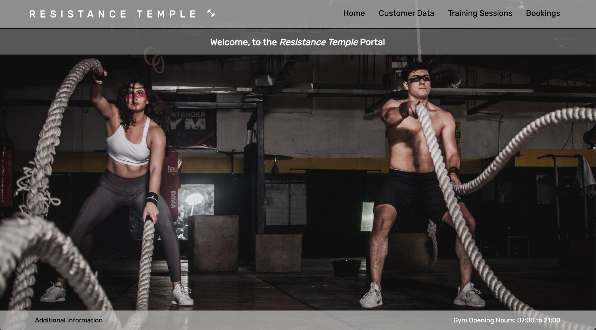

# This is a first attempt at a full stack project, designed and built by Colin Morrison, Codeclan Student.

The purpose of the project was to visually represent the skills obtained or expanded upon, during the first 4 weeks of Codeclan's Professional Software Development Bootcamp, March 2021 - Cohert G24.

## The project was based upon the following brief:

### "A local gym has asked you to build a piece of software to help them to manage memberships, and register members for classes.
* The app should allow the gym to create and edit Members
* The app should allow the gym to create and edit Classes
* The app should allow the gym to book members on specific classes
* The app should show a list of all upcoming classes
* The app should show all members that are booked in for a particular class"

## The app was all produced in Visual Studio code, utilizing the below technologies:
* PSQL
* Python3
* Flask
* HTML5 and CSS

## To run the app once downloaded:
* Open up the RESISTANCE_TEMPLE folder in Visual Studio Code
* Open up two terminals preferably, and change directory into the above folder
* In Terminal 1, run the following commands:
    * createdb resistance_temple
    * psql -d resistance_temple db/resistance_temple.sql;
    * python3 console.py
* In Terminal 2 (must remain open after running):
    * flask run
* Open up your browser (Chrome preferred), and redirect to:
    * http://localhost:5000/
* The home page will now be visible, and the site navigatable

## Home Page:
