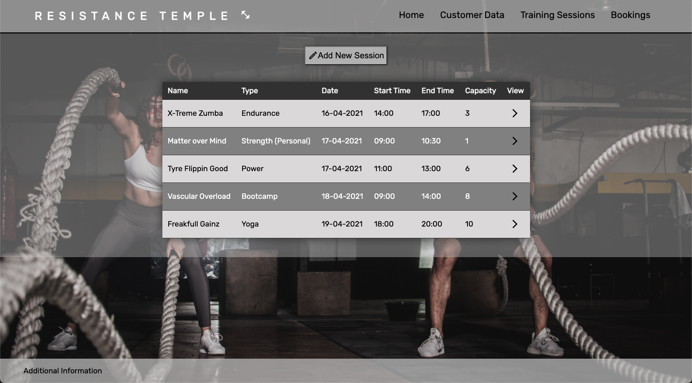
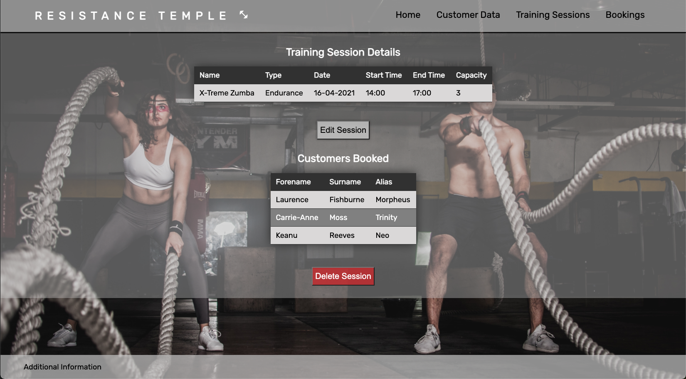
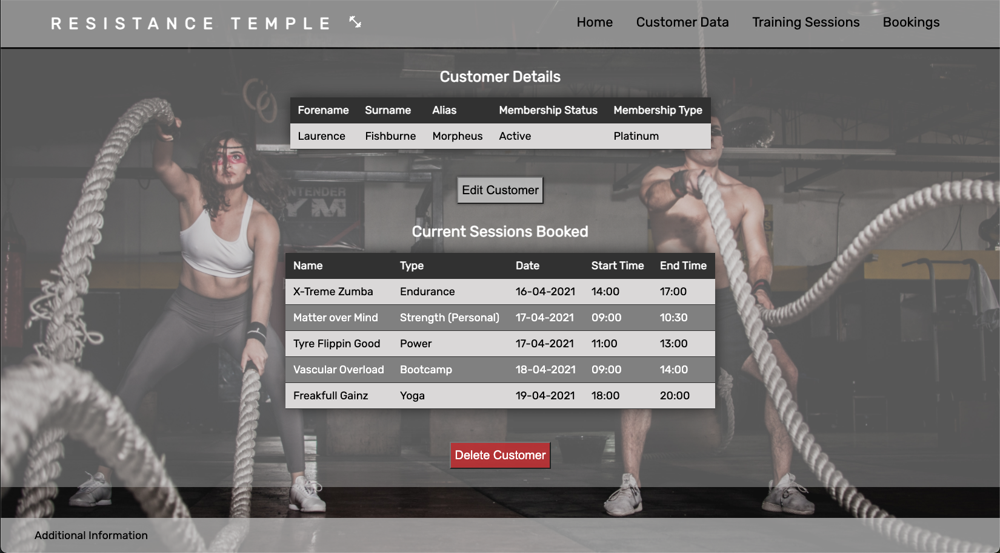

# Reistance Temple

## This was designed and built by Colin Morrison, Codeclan Student, and is a first attempt at full stack development

The purpose of the project was to visually represent the skills obtained or expanded upon, during the first 4 weeks of Codeclan's Professional Software Development Bootcamp, March 2021 - Cohert G24.

## The project was based upon the following brief:

### "A local gym has asked you to build a piece of software to help them to manage memberships, and register members for classes.
* The app should allow the gym to create and edit Members
* The app should allow the gym to create and edit Classes
* The app should allow the gym to book members on specific classes
* The app should show a list of all upcoming classes
* The app should show all members that are booked in for a particular class"

## The app was all produced in Visual Studio code, utilizing the below technologies:
* PSQL
* Python3
* Flask
* HTML5 and CSS

## To run the app once downloaded:
* Open up the RESISTANCE_TEMPLE folder in Visual Studio Code
* Open up two terminals preferably, and change directory into the above folder
* In Terminal 1, run the following commands:
    * createdb resistance_temple
    * psql -d resistance_temple db/resistance_temple.sql;
    * python3 console.py
* In Terminal 2 (must remain open after running):
    * flask run
* Open up your browser (Chrome preferred), and redirect to:
    * http://localhost:5000/
* The home page will now be visible, and the site navigatable

## Home Page:

## Key Front End Features:
* View all members (Customers)
* View all gym classes (sessions)
* Book a Customer into a given Session
* View all Bookings
* View a single Customer, showing all their current Bookings. The Customer can be Edited or Removed
* View a single Session, showing all current Customer Bookings in the Session. The Session can be Edited, or Removed
* Bookings can also be removed from the Bookings page

## Other Front End Functionality:
* When adding or editing a Session:
    * User can choose Dates and Times via Date/Time inputs
    * Date cannot be earlier than the Today's date
    * Time cannot be outwith the Gym Opening Hours (07:00-21:00) - Also our default Start/End times
    * Capacity cannot be < 1

## Other Back End Functionality:
* When adding a Customer:
    * A customer Alias is unique and will be checked for duplicated. The Alias cannot be edited, including upper/lowercase variants
* When adding a new Session:
    * The gym only has one room available for sessions. There cannot be an overlap of times
* When Booking a Customer into a Session:
    * Session must not be at full capacity
    * Customer must have an 'Active' membership
    * Booking must not already exist for the same Customer and Session

## Gym Classes (Sessions):

## View Individual Session:

## View Individual Customer:

